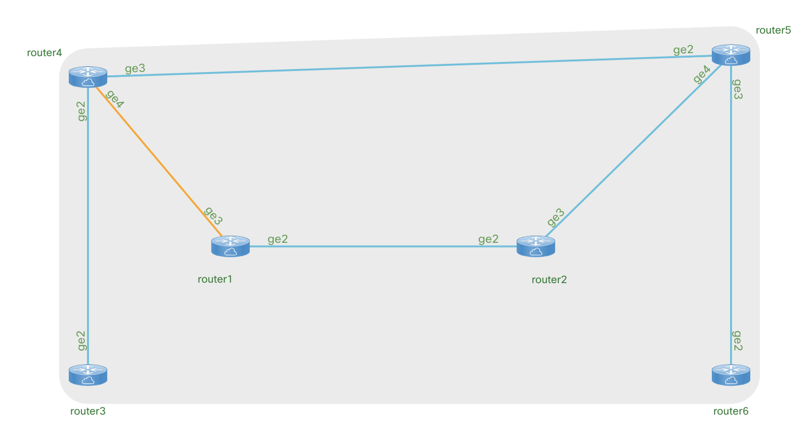

# net_dev_test_example

*Example of network development tooling for dev and test.*

## Motivation

This repo of netdev examples was put together to test and learn about virlutils, pyATS, and Genie.

## Show Me!

Here is the sample topology in VIRL

## Features

- Example topology with 6 routers
- Example pyATS test
- Example pyATS + Genie test

## Technologies & Frameworks Used

**Cisco Products & Services:**

- VIRL

**Tools & Frameworks:**

- virlutils
- Genie
- pyATS

## Usage

Using the example is easy:
- virl up
- virl ls && virl nodes
- _Confirm all nodes in simulation have come up_
- virl generate pyats
- make ping
- make bgp

## Installation

- git clone https://github.com/CiscoSE/net_dev_test_example
- virtualenv .venv -p python3
- pip install -r requirements.txt
- Create a .virlrc file with VIRL info
  - VIRL_HOST=ip
  - VIRL_USERNAME=
  - VIRL_PASSWORD=
- source env.sh

## Authors & Maintainers

- Sam Byers <sabyers@cisco.com>

## Credits

Most of the code in this repo is copypasta from the various example repos on DevNet. Here is some of the people credited with this awesome work:
- kecorbin
- RunSi
- jeaubin
- siming85

## License

This project is licensed to you under the terms of the [Cisco Sample
Code License](./LICENSE).
